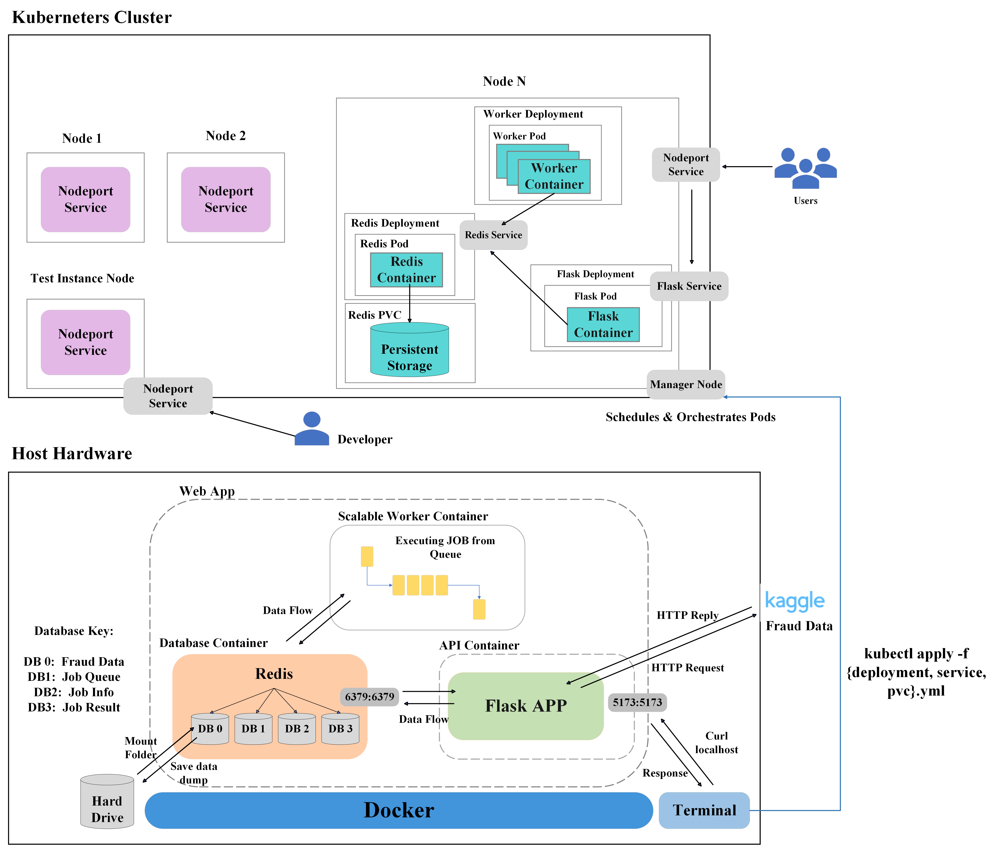

# **GuardianAI**

### Team Members: Reem Fashho, Owen Scott, Yi Yang

### Project Description

Our project focuses on leveraging the Credit Card Fraud Prediction Dataset available on Kaggle to create a robust containerized web application. This application utilizes a series of databases for efficient data storage and management, enabling user querying and facilitating job queues. By employing Flask, we will develop API endpoints that provide users with access to comprehensive summary statistics and plots derived from the Credit Card Fraud dataset. More importantly, considering the widespread utilization of this dataset for machine learning-based fraud detection, we aim to design our application to accept credit card input for predicting potential fraud from a pre-trained model we develop. This will allow users to submit a job, and retrieve a prediction about whether the particular credit card attributes are likely fraudulent. Our application is seamless, user-friendly, containerized, and published to the web. 

### Project Importance

This project is essential as it tackles the pressing issue of credit card fraud by using advanced explainable AI techniques on the Credit Card Fraud Prediction Dataset from Kaggle. It will provide a containerized web application that offers real-time fraud prediction, enhancing security measures for financial institutions and protecting consumers from fraudulent transactions.

### Data

**Source: https://www.kaggle.com/datasets/kelvinkelue/credit-card-fraud-prediction**

The dataset "Credit Card Fraud Prediction" is designed to evaluate and compare various fraud detection models. It comprises 555,719 records across 22 attributes, featuring a comprehensive mix of categorical and numerical data types with no missing values. Essential components of the dataset include:

- Transaction Details: Precise timestamps, merchant information, and transaction amounts.
- Fraud Indicator: A binary attribute marking transactions as fraudulent or legitimate, serving as the primary target for predictive modeling.
- Cardholder Information: Names, addresses, job titles, and demographics, providing a deep dive into the profiles involved in transactions.
- Geographical Data: Location details for both merchants and cardholders to explore spatial patterns in fraud occurrences.

This dataset is a rich resource that fosters the development, testing, and comparison of different fraud detection techniques. It is a valuable tool for researchers and practitioners dedicated to advancing the field of fraud detection through innovative modeling and analysis.

### Software Diagram

The following software diagram captures the primary components and workflow of our system. The diagram illustrates how data is queried from Kaggle and stored in a Redis Database that is presisited via frequent saving to the local system hardrive. Moreover, the diagram depicts the user's interaction with various routes via the Web Application, facilitating data access and job request submissions processed by the `Worker`. Additionally, the diagram illustrates how different databases are used for presisting the raw credit card data, the job queue, the client's submitted job information, and lastly a database for the job results. This entire process is encapsulated and deployed within a Docker container, seamlessly orchestrated by Kubernetes, which pulls the docker images from DockerHub, and scales the containers as necessary. 



### Description of Folder Contents

- `Dockerfile_api`: Contains instructions for building a Docker image of the API container
- `Dockerfile_test`: Contains instructions for building a Docker image that runs all of the tests
- `Dockerfile_worker`: Contains instructions for building a Docker image of the worker
- `docker-compose.yml`: docker-compose file used to spin up the whole project including the Redis database, Flask API, and worker container. It utilizes the Dockerfile_api and Dockerfile_worker files. Simply do `docker-compose up` to start the project.
- `docker-compose.test.yml`: docker-compose file used to run the tests, simply do `docker-compose -f docker-compose.test.yml up`
- `src/api.py`: Main Python script that interacts with our fraud data set, hosts the Flask app that allows the user to query for information, as well as interacts with the Redis database.
  - [GET] `/transaction_data`: Returns all data from Redis as an array of JSON transaction objects.
  - [POST] `/transaction_data`: Puts data into Redis.
  - [DELETE] `/transaction_data`: Deletes data in Redis.
  - [GET] `/transaction_data_view?limit=<int>&offset=<int>`: Returns a slice view of the data, beginning at the offset parameter (which defaults to zero) and ending at (offset + limit). limit parameter defaults to 5. Format is an array of JSON transaction objects.
  - [GET] `/amt_analysis`: Returns statistical descriptions of the transaction amounts in the dataset in JSON.
  - [GET] `/amt_fraud_correlation`: Returns the correlation between transaction amount ('amt') and fraud status ('is_fraud') in JSON.
  - [GET] `/fraudulent_zipcode_info`: Returns JSON describing the zipcode with the most fraud, how much fraud there was, the lat/lon of this zipcode, and a google maps link to it.
  - [GET] `/fraud_by_state`: Returns JSON dictionary with two-letter state abbreviations as the keys and the fraud counts as values. Omitted states had no occurrences of fraud.
  - [GET] `/jobs/<jobid>` : Returns all job information for a given JOB ID as JSON, including the arguments the job was POSTed with and the jobs current status in the 'status' key, e.g. {"graph_feature": "gender", "status": "queued"}
  - [GET] `/jobs`: Returns all existing JOB IDs as a JSON array of Strings.
  - [POST] `/jobs`: Creates a new job with a unique identifier (uuid). For our application, the client must provide a JSON body specifiying either a graph_feature they'd like analyzed (which can be any of 'trans_month', 'trans_dayOfWeek', 'gender', 'category') e.g. {'graph_feature': 'gender'} OR a list of transactions they'd like a ML model's analysis of with the following data included in each transaction object: 'trans_date_trans_time': String, 'merchant': String, 'category': String, 'amt': number, 'lat': number, 'long': number, 'job': String, 'merch_lat': number, 'merch_long': number. Note: the number-typed data must be floating point numbers. An example JSON body would look like {'transactions': [{"trans_date_trans_time": "01/02/2024 12:34".......}]}. An example job result would look like [\0.0], or [\1.0] if the transaction was inferred to be fraudulent. The returned JSON is in the format {"job_id": "anexamplejobid1234"}
  - [DELETE] `/jobs`: Clears all jobs.
  - [GET] `/results/<jobid>`: Return requested job result either as a file download for graph_feature jobs or a JSON array for transactions jobs. If the job has not yet been finished, this results in a 400 Bad request.
- `src/worker.py`: Pull jobs off of the queue, attempts them, and stores their results and updated states in Redis.
- `src/services.py`: Provides convenient functionalities used by both api.py and worker.py. This includes things like initializing Redis and HotQueue, reading environment variables, validating inputs, and quickly reading data out of Redis.
- `src/ml/input_vectorization.py`: Includes functionalities for making a test/validate/train split and parsing and encoding training and evaluation data.
- `src/ml/ml_model.py`: Implements a nn BinaryClassifier to detect fraud. This model is optimized for accuracy and was trained with a loss function that weighted the classes equally. If you would like to detect more true positives and have fewer false negatives, at the expense of having _significantly_ more false positives, you can re-train the model with a higher weighting on the fraudulent class. Current performance metrics for the model are as follows:
  True positives: 91
  True negatives: 55320
  False positives: 54
  False negatives: 107
  Accuracy: 0.997102857554164
  Precision: 0.6275862068965518
  Recall: 0.4595959595959596
  F1: 0.5306122448979592
  AUROC: 0.7293103863425675
- `src/ml/binaryclassifierstate.pt`: The state of the pre-trained BinaryClassifier. This is the state the model is in when worker.py uses it for inferences.
- `src/ml/meanandstd.txt`: Stored copies of the mean and std tensors across the dataset. These are used to normalize any input vectors provided for inferences.
- `src/ml/categories.txt`, `src/ml/jobs.txt`, `src/ml/merchants.txt`: Stored sorted copies of lists of payment categories, jobs, and merchants that occur in the dataset. There are no duplicate entries. These files are read in as lists and used for onehot encoding in the inference process.
- `requirements_api.txt`: Text file listing all of the external Python library requirements used by the API service.
- `requirements_worker.txt`: Text file listing all of the external Python library requirements used by the Worker service. These are separate to minimize container size.
- `kubernetes/`: Directory for the Kubernetes configuration files.
- `redis-data/`: Directory for Redis container to presist data to file system across container executions.
- `test/test_api.py`: Exhaustively tests functionality in `src/api.py`
- `test/test_services.py`: Exhaustively tests functionality in `src/services.py`
- `test/test_worker.py`: Tests functionailty in `src/worker.py`

Note: All throughout the code source, strategic logging is implemented to alert the developer of important events and bugs that arise. Logs are printed to the console.

### Flask Application

#### Instructions for running the tests

Simply run `docker-compose -f docker-compose.test.yml up`
This will spin up a test container with all of the code and dependencies and will run pytest against all test files. The container will exit when tests are complete.

#### Instructions on How to Deploy Containerized Code with docker-compose

Once the code has been pulled, execute: `docker-compose up`.

This will effectively build and deploy the docker images as containers ensuring port to port mapping and proper organization and dependency between the containers. Specifically, the command builds the `worker` and `flask-app` images and pulls the `redis` stock image for use.

Execute `docker ps -a` to ensure the three containers are up and runnning. You should see the following:

```
CONTAINER ID   IMAGE                           COMMAND                  CREATED          STATUS                      PORTS                                       NAMES
0ed6746af37c   username/fraud_detect_app:1.0   "python3 api.py"         58 seconds ago   Up 57 seconds               0.0.0.0:5173->5173/tcp, :::5173->5173/tcp   guardianai_flask-api_1
e89eb33406de   username/fraud_detect_app:1.0   "python3 worker.py"      58 seconds ago   Up 57 seconds                                               guardianai_worker_1
dc51e6ac5ae9   redis:7                         "docker-entrypoint.s…"   59 seconds ago   Up 58 seconds               0.0.0.0:6379->6379/tcp, :::6379->6379/tcp   guardianai_redis-db_1
```

- Note for developers: If you make edits to any of the contaner source files (i.e, `worker.py` or `app.py`), you can redeploy the containers by simply running: `docker-compose up --build  <edited_image>` rather than executing `docker-copmpose down` followed by `docker-compose up --build -d` again.

Once you have ensured that the microservice is up and running, you can access the application via `curl` commands listed below locally.

#### Instructions for Deploying Application on Kubernetes Cluster
To deploy the containerized application onto the Kubernetes cluster, create the following deployments. 

```
kubectl apply -f app-prod-deployment-flask.yml
kubectl apply -f app-prod-deployment-redis.yml
kubectl apply -f app-prod-deployment-worker.yml
```

List the deployments and make sure they are all running via `kubectl get deployments`. You should also see that the pods are up and running by executing `kubectl get pods`. 

Since our application utilizes databases, we need to persist the data across container starts and stops. In k8s, this is achieved via PVCs. Execute the following: 

```
# Instruct k8s to fill a volume with a PVC
kubectl apply -f app-prod-pvc-redis.yml

# Create PVC
kubectl apply -f pvc-basic.yaml
```

k8s Services provides a way for an application running as a collection of pods on a single IP and port. To achieve this execute the following: 

```
kubectl apply -f app-prod-service-flask.yml
kubectl apply -f app-prod-service-redis.yml
```

Afterwards, excute `kubectl get services` to view the new serice with private IP. Using the listed IP address and port, you should be able to communicate the with Flask Server. To achieve this, you must be on the k8s private network so you need to `exec` into the pod and then from the inside, execute a command as such: 

```
curl <ipaddress>:<PORT>/help
```

#### Using Application at Public Endpoint 
Public acccess to our deployment is made possible via k8s `Service` object of type `Nodeport` which exposes our Flask API on a public port. `Ingress` specifies the subdomain to make the Flask API available on and maps this domain to the public port created. 

To achieve this. First create the NodePort
```
kubectl apply -f app-service-nodeport-flask.yml
```

Then, check that the service was created successfully and determine what port it was created for it. For example by running, `kubectl get services`
```
NAME                           TYPE        CLUSTER-IP     EXTERNAL-IP   PORT(S)          AGE

```

Test that the NodePort Service is working why using the special domain: `coe332.tacc.cloud` to exercise your Flask API from the kube-access VM:

```
curl coe332.tacc.cloud:<port>/help
```

To map tht NodePort to a specific domain on the public internet, create the ingress object: 

```
kubectl apply -f app-test-ingress-flask.yaml
```
After that is successfully executed, you should be able to access the Flask Application on the internet, from the domain specified in the host field of the `ingress` yaml. 

Try this by running the following command from any machine. 

```
curl username-flask.coe332.tacc.cloud/help
```

#### Instructions For Accessing Web App Routes & Route Output Descriptions

While the service is up (after executing `docker-compose up`), you may curl the following example commands to interact with the application.

**Curl Commands to Routes: `curl http://<ipaddress>:port/route`**

1. **POST Data to Redis Database Endpoint**

   - **Description**: This endpoint stores the raw data into a Redis database that supports data persistence across container executions. POSTing the data takes a few minutes.

     ```shell
     curl -X POST localhost:5173/transaction_data
     ```

   - _expected output_

     ```shell
     OK
     ```

2. **GET Data from Redis Database Endpoint**

   - **Description**: This endpoint retrieves all of the data stored from the Redis database as a list of dictionaries. GETting the data takes a few minutes.

     ```shell
     curl localhost:5173/transaction_data
     ```

   - _expected output_

     ```shell
     {
         "amt": 55.49,
         "category": "entertainment",
         "cc_num": 4428150000000000.0,
         "city": "Colton",
         "city_pop": 761,
         "dob": "30/06/1943",
         "first": "Brittany",
         "gender": "F",
         "is_fraud": 0,
         "job": "Chief Marketing Officer",
         "last": "Guerra",
         "lat": 46.5901,
         "long": -117.1692,
         "merch_lat": 45.957848,
         "merch_long": -116.587284,
         "merchant": "fraud_Effertz, Welch and Schowalter",
         "state": "WA",
         "street": "79209 Gary Dale",
         "trans_date_trans_time": "05/10/2020 11:04",
         "trans_num": "f6ff017f02cc92423a2b88a0be0d387a",
         "unix_time": 1380971076,
         "zip": 99113
       },
       ...
       {
         "amt": 1.45,
         "category": "misc_net",
         "cc_num": 4.50254e+18,
         "city": "Ash Flat",
         "city_pop": 2856,
         "dob": "27/08/1926",
         "first": "Stephanie",
         "gender": "F",
         "is_fraud": 0,
         "job": "Hydrologist",
         "last": "Cummings",
         "lat": 36.2201,
         "long": -91.6421,
         "merch_lat": 36.198675,
         "merch_long": -90.757786,
         "merchant": "fraud_Nader-Heller",
         "state": "AR",
         "street": "1025 Robin Square",
         "trans_date_trans_time": "25/06/2020 05:50",
         "trans_num": "fad0975d67dd801858619f5009a9fb98",
         "unix_time": 1372139451,
         "zip": 72513
       }
     ```

3. **DELETE Data from Redis Database Endpoint**

   - **Description**: This endpoint deletes all of the data stored in the Redis database. To execute other endpoints that rely on the data, `curl -X POST curl localhost:5173/data` must be re-executed.

     ```shell
     curl -X DELETE localhost:5173/transaction_data
     ```

   - _expected output_

     ```shell
     OK
     ```

4. **Data Example Endpoint**

   - **Description**: This endpoint provides a quick look at the dataset by returning the first five entries. If the user wishes to see n records offset by some number, they may specify a limit and offset query parameter, otherwise, the first five entries are returned via: `curl localhost:5173/transaction_data_view`

     ```shell
     curl "localhost:5173/transaction_data_view?limit=2&offset=7"
     ```

   - _expected output_

     ```shell
      [
       {
         "amt": 10.37,
         "category": "personal_care",
         "cc_num": 3589290000000000.0,
         "city": "Spencer",
         "city_pop": 343,
         "dob": "05/03/1972",
         "first": "Paula",
         "gender": "F",
         "is_fraud": 0,
         "job": "Development worker, international aid",
         "last": "Estrada",
         "lat": 43.7557,
         "long": -97.5936,
         "merch_lat": 44.495498,
         "merch_long": -97.728453,
         "merchant": "fraud_Reichel LLC",
         "state": "SD",
         "street": "350 Stacy Glens",
         "trans_date_trans_time": "21/06/2020 12:15",
         "trans_num": "8be473af4f05fc6146ea55ace73e7ca2",
         "unix_time": 1371816950,
         "zip": 57374
       },
       {
         "amt": 4.37,
         "category": "shopping_pos",
         "cc_num": 3596360000000000.0,
         "city": "Morrisdale",
         "city_pop": 3688,
         "dob": "27/05/1973",
         "first": "David",
         "gender": "M",
         "is_fraud": 0,
         "job": "Advice worker",
         "last": "Everett",
         "lat": 41.0001,
         "long": -78.2357,
         "merch_lat": 41.546067,
         "merch_long": -78.120238,
         "merchant": "fraud_Goyette, Howell and Collier",
         "state": "PA",
         "street": "4138 David Fall",
         "trans_date_trans_time": "21/06/2020 12:16",
         "trans_num": "71a1da150d1ce510193d7622e08e784e",
         "unix_time": 1371816970,
         "zip": 16858
       }
     ]
     ```

5. **Amount Analysis Endpoint**

   - **Description**: This endpoint provides statistical summaries of the transaction amounts.

     ```shell
     curl localhost:5173/amt_analysis
     ```

   - _expected output_

     - **count**: Total number of transactions.
     - **mean**: Average amount of transactions.
     - **std**: Standard deviation of the transaction amounts.
     - **min**: Minimum transaction amount.
     - **25%**: 25th percentile of the transaction amounts.
     - **50%** (median): Median of the transaction amounts.
     - **75%**: 75th percentile of the transaction amounts.
     - **max**: Maximum transaction amount.

     ```shell
     {
       "25%": 9.63,
       "50%": 47.29,
       "75%": 83.01,
       "count": 555719.0,
       "max": 22768.11,
       "mean": 69.39281023322938,
       "min": 1.0,
       "std": 156.74594135531336
     }
     ```

6. **Amount-Fraud Correlation Endpoint**

   - **Description**: This endpoint calculates the correlation between transaction amounts (`amt`) and their fraud status (`is_fraud`). Correlation measures the degree to which two variables move in relation to each other. A higher positive correlation means that higher transaction amounts might be more associated with fraudulent transactions, whereas a negative correlation would indicate the opposite.

     ```shell
     curl localhost:5173/amt_fraud_correlation
     ```

   - _expected output_

     ```shell
     {
       "amt": {
         "amt": 1.0,
         "is_fraud": 0.18226707130820347
       },
       "is_fraud": {
         "amt": 0.18226707130820347,
         "is_fraud": 1.0
       }
     }
     ```

7. **Fraudulent Zipcode Information Endpoint**

   - **Description**: This endpoint calculates which zipcode has the highest number of fraudulent transactions from the dataset and retrieves geographical information for that zipcode. It serves to identify potential hotspots of fraudulent activity and provides a quick link to view the location on Google Maps.

     ```shell
     curl localhost:5173/fraudulent_zipcode_info
     ```

   - _expected output_

     - **most_fraudulent_zipcode**: The zipcode with the highest number of fraud cases.
     - **fraud_count**: The number of frauds recorded in that zipcode.
     - **latitude** and **longitude**: Geographic coordinates of the zipcode.
     - **Google Maps Link**: Direct link to view the location on Google Maps.

     ```shell
     {
       "Google Maps Link": "https://www.google.com/maps/search/?api=1&query=38.02014542,-97.67005157",
       "fraud_count": 19,
       "latitude": 38.02014542,
       "longitude": -97.67005157,
       "most_fraudulent_zipcode": "67020"
     }
     ```

     

8. **Fraud by State Endpoint**

   - **Description**: This endpoint aggregates the number of fraudulent transactions from the `fraud_test.csv` dataset by state. It provides a detailed count of fraudulent activities grouped by each state to help identify regions with higher instances of fraud.

     ```shell
     curl localhost:5173/fraud_by_state
     ```

   - _expected output_

     - Each state's abbreviation is listed along with the number of fraudulent transactions recorded in that state. This summary helps in understanding the geographic distribution of fraudulent activities.

     ```python
     {
       "AK": 14,
       "AL": 63,
       "AR": 34,
       "AZ": 27,
       "CA": 76,
       ...
       "TN": 19,
       "TX": 113,
       "VA": 75,
       "WA": 30,
       "WI": 65,
       "WY": 9
     }
     ```

9. **Retrieve All Existing Jobs Endpoint**

   - **Description**: This endpoint returns all of the existing job uuids from the database.

     ```shell
     curl localhost:5173/jobs
     ```

   - _expected output_

     ```shell
     [af7c1fe6-d669-414e-b066-e9733f0de7a8, 08c71152-c552-42e7-b094-f510ff44e9cb]
     ```

10. **Clear Jobs Endpoint**

    - **Description**: This endpoint clears all jobs from the jobs database.

      ```shell
      curl -X DELETE localhost:5173/jobs
      ```

    - _expected output_

      ```shell
      OK
      ```

11. **Generate Graph for Feature Endpoint**

    - **Description**: This endpoint initializes a job based on the user's input in JSON format, specifically their graph feature preferences. The job is then queued for processing, allowing the worker to generate a PNG plot. Once generated, the plot can be downloaded and viewed by the user.

      Based on what information the user desires to analyze, they may submit one of the following graph features which will be utilized as the independent variable of the generated graph. If the user fails to submit a feature from the feature options listed below or submits the `curl` command incorrectly, a respective error message with intructions to correct the `POST` request will be generated.

      Feature Options for Graphing: ['trans_month','trans_dayOfWeek','gender','category']

      ```shell
      curl -X POST localhost:5173/jobs -d '{"graph_feature": "gender"}' -H "Content-Type: application/json"
      ```

    - _expected output_

      ```shell
      {"job_id": "af7c1fe6-d669-414e-b066-e9733f0de7a8"}
      ```

12. **Generate AI Inferences on Transactions**

    - **Description**: This endpint initializes a job based on the user's input in JSON format, specifically their 'transactions' JSON object array. The job is then queued for processing, allowing the worker to load up the model and do calculations to make inferences. Once complete, the inferences are available at the `/results/<job_id>` endpoint. Invalid curls or POST requests with invalid args will generate corresponding error messages. Just like the other kind of POST to `/jobs`, the endpiont will return a JSON-formatted object with the job id, e.g. `{"job_id": "af7c1fe6-d669-414e-b066-e9733f0de7a8"}`

13. **Retrieve Job Status Endpoint**

    - **Description**: This endpoint provides details about a specified job ID, facilitating users in querying the status of submitted jobs and recalling the feature intended for plotting or transasctions intended for inference.

      ```shell
      curl http://127.0.0.1:5173/jobs/ af7c1fe6-d669-414e-b066-e9733f0de7a8
      ```

    - _expected output_

      ```shell
      {
        'status': 'queued',
        'graph_feature': 'gender',
      }
      ```

14. **Retrieve Result from Submitted Job**

    - **Description**: This endpoint returns a JSON array of inferences or png file download of the graphs requested from the user based on the job type and independent variable submitted in the job request.

      ```shell
      curl http://127.0.0.1:5173/results/af7c1fe6-d669-414e-b066-e9733f0de7a8
      ```

    - _expected output_

      

      

      

      

      OR

      `[0.0, 1.0, 0.0, 0.0, 0.0, 1.0]`

15. **Informational Help Endpoint**

    - **Description**: This endpoint returns a description of all of the routes as well as an example curl command.

      ```shell
      curl http://127.0.0.1:5173/help
      ```

    - _expected output_

      ```shell
        Description of all application routes:
        /transaction_data (GET): Returns all transaction data currently stored in Redis.
          Example Command: curl "localhost:5173/transaction_data"
      
        /transaction_data (POST): Fetches transaction data from Kaggle or disk and stores it in Redis.
          Example Command: curl -X POST "localhost:5173/transaction_data"
      
        /transaction_data (DELETE): Deletes all transaction data stored in Redis.
          Example Command: curl -X DELETE "localhost:5173/transaction_data"
      
        /transaction_data_view(GET): Returns a default slice of the transaction data stored in Redis (first 5 entries).
          Example Command: curl "localhost:5173/transaction_data_view"
      
        /transaction_data_view?limit=<int>&offset=<int> (GET): Returns a slice of the transaction data stored in Redis.
          Example Command: curl "localhost:5173/transaction_data_view?limit=2&offset=7"
      
        /amt_analysis (GET): Returns statistical descriptions of the transaction amounts in the dataset.
          Example Command: curl "localhost:5173/amt_analysis"
      
        /amt_fraud_correlation (GET): Returns the correlation between transaction amount and fraud status in the dataset.
          Example Command: curl "localhost:5173/amt_fraud_correlation"
      
        /fraudulent_zipcode_info (GET): Returns the zipcode with the highest number of fraudulent transactions, and retrieves its geographic location.
          Example Command: curl "localhost:5173/fraudulent_zipcode_info"
      
        /fraud_by_state (GET):  Returns the number of fraudulent transactions per state.
          Example Command: curl "localhost:5173/fraud_by_state"
      
        /ai_analysis (GET): Returns the most important features and feature importances from the trained model.
          Example Command: curl "localhost:5173/ai_analysis"
      
        /jobs (GET): Returns all job ids in the database.
          Example Command: curl "localhost:5173/jobs"
      
        /jobs (DELETE): Clears all jobs from the jobs database.
          Example Command: curl -X DELETE "localhost:5173/jobs"
      
        /jobs (POST): Creates a job for plotting a feature specified by the user.
          Example Command: curl -X POST "localhost:5173/jobs" -d "{"graph_feature": "gender"}" -H "Content-Type: application/json"
      
        /jobs/<id> (GET): Returns information about the specified job id.
          Example Command: curl "localhost:5173/jobs/99e6820f-0e4f-4b55-8052-7845ea390a44"
      
        /results/<id> (GET): Returns the job result as a image file download.
          Example Command: curl "localhost:5173/results/99e6820f-0e4f-4b55-8052-7845ea390a44"
      ```

### **Kubernetes**

- **app-test-deployment-flask.yml**

  This file defines a Kubernetes deployment configuration for managing a test instance of our Flask application. The deployment specifies a single replica (replicas: 1) running our application within an Ubuntu 22.04 container. The Flask app is initiated by executing the python api.py command, ensuring it runs in an isolated environment within the Kubernetes cluster tailored for testing. This setup is exclusively for the test environment, providing a controlled setting that allows developers to perform thorough testing and verification of the application's functionality before it is deployed to production.

- **app-test-deployment-redis.yml**

  This file defines a Kubernetes deployment configuration for managing a test instance of Redis in our environment. The deployment specifies a single replica (replicas: 1) running Redis on an Ubuntu 22.04 container. This setup is specifically for the test environment, enabling developers to conduct comprehensive functional tests and validations of the Redis instance within an isolated Kubernetes cluster setting before deployment to production.

- **app-test-deployment-worker.yml**

  This file defines a Kubernetes deployment configuration for managing a test instance of our background worker in the environment. The worker is initiated by executing the python worker.py command, ensuring it operates within an isolated environment in the Kubernetes cluster.

- **app-test-ingress-flask.yml**

  This configuration file defines a Kubernetes Ingress resource that manages access to the Flask application within the test environment. The Ingress is set up with Nginx as the ingress class and allows access through the specified hostname username-flask.coe332.tacc.cloud without SSL redirection. It details a routing rule where all traffic to the root path (/) is directed to the flask-api-nodeport-service-test service on port 5173. This setup facilitates easy access to the Flask application for external users during development and testing, without the need for complex networking configurations.

- **app-test-pvc-redis.yml**

  This configuration file sets up a Kubernetes deployment for a Redis instance in the test environment, integrating a Persistent Volume Claim (PVC) for data persistence. The deployment ensures that Redis runs with the ubuntu:22.04 image as a single replica. Notably, it configures a volume named redis-<username>-data, mounted at /data, which utilizes the PVC redis-<username>-data to persist data. This arrangement guarantees data retention across container restarts, making it ideal for testing scenarios that require data persistence.

- **app-test-service-flask.yml**

  This file defines a Kubernetes Service that exposes the Flask API in the test environment through a ClusterIP service. The service uses the label selector app: flask-api to target the corresponding Pods, routing traffic to the Flask application on port 5173. This setup ensures that only other services within the cluster can access the Flask API, maintaining network security and isolation.

- **app-test-service-nodeport-flask.yml**

  This file defines a ClusterIP service as well, similar to the above. It exposes the Flask API on port 5173, ensuring that the service is accessible only within the Kubernetes cluster.

- **app-test-service-redis.yml**

  This file defines a Kubernetes Service that exposes the Redis instance in the test environment using a ClusterIP service type. Utilizing the label selector app: redis to target the relevant Pods, the service is configured to route traffic on port 6379 to the Redis instance. The ClusterIP configuration ensures that the service is only accessible internally within the cluster, ideal for protected backend services such as databases.

#### Instructions to Stop Microservice

When you are ready to remove and kill the services, execute the following command: `docker-compose down`
