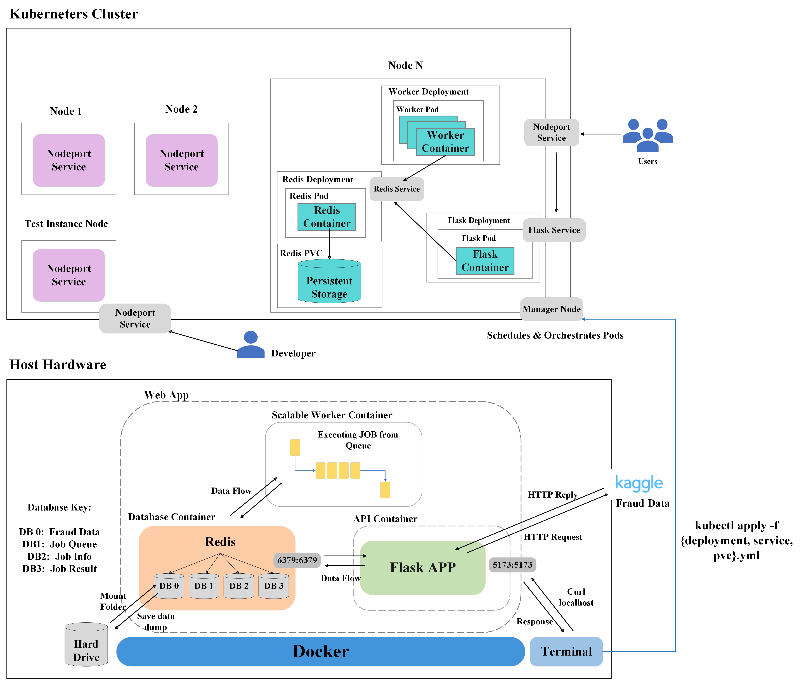

### Project Description

Our project focuses on leveraging the Credit Card Fraud Prediction Dataset available on Kaggle to create a robust containerized web application. This application will utilize databases for efficient data storage and management, enabling user querying and facilitating job queues. By employing Flask, we will develop API endpoints that provide users with access to comprehensive summary statistics and plots derived from the Credit Card Fraud dataset. More importantly, considering the widespread utilization of this dataset for machine learning-based fraud detection, we aim to design our application to accept credit card input for predicting potential fraud from a pre-trained model we develop. This will allow users to submit a job, and retrieve a prediction about whether the particular credit card attributes are likely fraudulent.

### Project Importance

This project is essential as it tackles the pressing issue of credit card fraud by using advanced explainable AI techniques on the Credit Card Fraud Prediction Dataset from Kaggle. It will provide a containerized web application that offers real-time fraud prediction, enhancing security measures for financial institutions and protecting consumers from fraudulent transactions.

### Data

**Source: https://www.kaggle.com/datasets/kelvinkelue/credit-card-fraud-prediction**

The dataset "Credit Card Fraud Prediction" is designed to evaluate and compare various fraud detection models. It comprises 555,719 records across 22 attributes, featuring a comprehensive mix of categorical and numerical data types with no missing values. Essential components of the dataset include:

- Transaction Details: Precise timestamps, merchant information, and transaction amounts.
- Fraud Indicator: A binary attribute marking transactions as fraudulent or legitimate, serving as the primary target for predictive modeling.
- Cardholder Information: Names, addresses, job titles, and demographics, providing a deep dive into the profiles involved in transactions.
- Geographical Data: Location details for both merchants and cardholders to explore spatial patterns in fraud occurrences.

This dataset is a rich resource that fosters the development, testing, and comparison of different fraud detection techniques. It is a valuable tool for researchers and practitioners dedicated to advancing the field of fraud detection through innovative modeling and analysis.

### Application Architecture

The simplest way to define the goal of our microservice is to offer clients a means to query and make predictions about credit card fraud data. To achieve this, our microservice retrieves data hosted on Kaggle and presists it into a Redis Database. This data is then used as the source for analyses triggered by clients submitting HTTP requests. To achieve this, we used Flask, which is a web framework that allows developers to create web routes that eventually lead to the development of entire websites. Web routes, also known as endpoints, are the addresses we ask a server to retrieve data from. Based on the endpoint, our Flask application performs a particular task such as returning summary statitics about the credit card data. Additionally, our application allows clients to submit jobs to a queue. Through a back-end worker, jobs pushed onto the queue are popped off and executed in the order they are submitted. This allows multiple users to request jobs from the worker, and in order, the back end worker completes the task at and and stores the result into a database that the client can retrieve the completed job (in this case a graph) from. 

This functionailty is then all containerized in a Docker container, which is essentially packaged software that runs agnostically in any environment. Regardless of the operating system executing the application or the version of a library installed on an individual’s system, containers allow for platform-agnostic and reproducible results. So once the image of the web service is created and published onto a Docker Image Web Hosting service such as DockerHub, anyone can pull the image and run the Docker Container to run the application as intended. Lastly, we integrated Kubernetes as our container orchestrator to manage and scale our Docker containers effectively. Kubernetes, often abbreviated as K8s, is an open-source platform designed to automate deploying, scaling, and operating application containers. It abstracts away the underlying infrastructure complexities, allowing developers to focus on building and deploying their applications without worrying about the operational overhead. With Kubernetes, we can define desired states for our containerized applications, such as how many instances should be running, and Kubernetes takes care of ensuring that the desired state is maintained, even in the face of failures or fluctuations in demand. Additionally, Kubernetes offers features like load balancing, service discovery, and self-healing capabilities, which further enhance the reliability and scalability of our microservice architecture. By leveraging Kubernetes as our container orchestrator, we can efficiently manage our Docker containers across a cluster of machines, ensuring high availability, fault tolerance, and seamless scaling as our application grows

### Software Diagram

The following software diagram captures the primary components and workflow of our system. The diagram illustrates how data is queried from Kaggle and stored in a Redis Database that is presisited via frequent saving to the local system hardrive. Moreover, the diagram depicts the user's interaction with various routes via the Web Application, facilitating data access and job request submissions processed by the `Worker`. Additionally, the diagram illustrates how different databases are used for presisting the raw credit card data, the job queue, the client's submitted job information, and lastly a database for the job results. This entire process is encapsulated and deployed within a Docker container, seamlessly orchestrated by a Kubernetes cluster for enhanced scalability and efficient resource utilization.



### API Routes

Our application offers the client <X> different routes to query the Flask Server. Once the application is running, clients may utilize curl commands to access information about the credit card data. 
To execute a curl command, the following command format is followed: `curl -X <HTTP method> http://<ipaddress>:port/route`


For example, for the user to extract data from Kaggle and presist it into the Redis Database, the following `curl` is executed.

-  `curl -X POST localhost:5173/data`

Once the data is posted to the database, the client can query other endpoints that require the data to be avalaible. For example, the command, `curl localhost:5173/transaction_data_view` provides a quick look at the dataset by returning the first five entries. If the user wishes to see n records offset by some number, they may specify a limit and offset query parameter, otherwise, the first five entries are returned via: `curl localhost:5173/transaction_data_view`. This will return:

```shell
      [
       {
         "amt": 10.37,
         "category": "personal_care",
         "cc_num": 3589290000000000.0,
         "city": "Spencer",
         "city_pop": 343,
         "dob": "05/03/1972",
         "first": "Paula",
         "gender": "F",
         "is_fraud": 0,
         "job": "Development worker, international aid",
         "last": "Estrada",
         "lat": 43.7557,
         "long": -97.5936,
         "merch_lat": 44.495498,
         "merch_long": -97.728453,
         "merchant": "fraud_Reichel LLC",
         "state": "SD",
         "street": "350 Stacy Glens",
         "trans_date_trans_time": "21/06/2020 12:15",
         "trans_num": "8be473af4f05fc6146ea55ace73e7ca2",
         "unix_time": 1371816950,
         "zip": 57374
       },
       {
         "amt": 4.37,
         "category": "shopping_pos",
         "cc_num": 3596360000000000.0,
         "city": "Morrisdale",
         "city_pop": 3688,
         "dob": "27/05/1973",
         "first": "David",
         "gender": "M",
         "is_fraud": 0,
         "job": "Advice worker",
         "last": "Everett",
         "lat": 41.0001,
         "long": -78.2357,
         "merch_lat": 41.546067,
         "merch_long": -78.120238,
         "merchant": "fraud_Goyette, Howell and Collier",
         "state": "PA",
         "street": "4138 David Fall",
         "trans_date_trans_time": "21/06/2020 12:16",
         "trans_num": "71a1da150d1ce510193d7622e08e784e",
         "unix_time": 1371816970,
         "zip": 16858
       }
     ]
```
TODO - DISCUSS MORE ROUTES HERE. ML for example

An aspect of our application is providing clients with the ability to submit jobs. In this context, a job is a long running task that the client requests. Requets are processed via a queue, so the backend of our application serves teh clients one at a time. 
**Generate Graph for Feature Endpoint**

    - **Description**: This endpoint initializes a job based on the user's input in JSON format, specifically their graph feature preferences. The job is then queued for processing, allowing the worker to generate a PNG plot. Once generated, the plot can be downloaded and viewed by the user. 

      Based on what information the user desires to analyze, they may submit one of the following graph features which will be utilized as the independent variable of the generated graph. If the user fails to submit a feature from the feature options listed below or submits the `curl` command incorrectly, a respective error message with intructions to correct the `POST` request will be generated. 

      Feature Options for Graphing: ['trans_month','trans_dayOfWeek','gender','category']

      ```shell
      curl -X POST localhost:5173/jobs -d '{"graph_feature": "gender"}' -H "Content-Type: application/json"
      ```

    - _expected output_

      ```shell
      {"job_id": "af7c1fe6-d669-414e-b066-e9733f0de7a8"}
      ```

13. **Retrieve Job Status Endpoint**

    - **Description**: This endpoint provides details about a specified job ID, facilitating users in querying the status of submitted jobs and recalling the feature intended for plotting. 

      ```shell
      curl http://127.0.0.1:5173/jobs/ af7c1fe6-d669-414e-b066-e9733f0de7a8
      ```

    - _expected output_

      ```shell
      {
        'status': 'queued',
        'graph_feature': 'gender',
      }
      ```

**Retrieve Graph Image from Submitted Job**

    - **Description**: This endpoint returns a png file download of the graphs requested from the user based on the independent variable submitted in the job request. 

      ```shell
      curl http://127.0.0.1:5173/results/af7c1fe6-d669-414e-b066-e9733f0de7a8
      ```

    - *expected output*

      

      

      

      


**Informational Help Endpoint**

    - **Description**: This endpoint returns a description of all of the routes as well as an example curl command.  

      ```shell
      curl http://127.0.0.1:5173/help
      ```

    - _expected output_

      ```shell
        Description of all application routes:
        /transaction_data (GET): Returns all transaction data currently stored in Redis.
          Example Command: curl http://127.0.0.1:5173/transaction_data
      
        /transaction_data (POST): Fetches transaction data from Kaggle or disk and stores it in Redis.
          Example Command: curl -X POST localhost:5173/transaction_data
      
        /transaction_data (DELETE): Deletes all transaction data stored in Redis.
          Example Command: curl -X DELETE localhost:5173/transaction_data
      
        /transaction_data_view: Returns a default slice of the transaction data stored in Redis (first 5 entries).
          Example Command: curl localhost:5173/transaction_data_view
      
        /transaction_data_view?limit=<int>&offset=<int>: Returns a slice of the transaction data stored in Redis.
          Example Command: curl "localhost:5173/transaction_data_view?limit=2&offset=7"
      
        /amt_analysis: Returns statistical descriptions of the transaction amounts in the dataset.
          Example Command: curl "localhost:5173/amt_analysis"
      
        /amt_fraud_correlation: Returns the correlation between transaction amount and fraud status in the dataset.
          Example Command: curl "localhost:5173/amt_fraud_correlation"
      
        /fraudulent_zipcode_info: Returns the zipcode with the highest number of fraudulent transactions, and retrieves its geographic location.
          Example Command: curl "localhost:5173/fraudulent_zipcode_info"
      
        /fraud_by_state:  Returns the number of fraudulent transactions per state.
          Example Command: curl "localhost:5173/fraud_by_state"
      
        /ai_analysis: Returns the most important features and feature importances from the trained model.
          Example Command: curl "localhost:5173/ai_analysis"
      
        /jobs (GET): Returns all job ids in the database.
          Example Command: curl "localhost:5173/jobs"
      
        /jobs (DELETE): Clears all jobs from the jobs database.
          Example Command: curl -X DELETE "localhost:5173/jobs"
      
        /jobs (POST): Creates a job for plotting a feature specified by the user.
          Example Command: curl -X POST localhost:5173/jobs -d "{"graph_feature": "gender"}" -H "Content-Type: application/json"
      
        /jobs/<id>: Returns information about the specified job id.
          Example Command: curl -X DELETE "localhost:5173/jobs/99e6820f-0e4f-4b55-8052-7845ea390a44"
      
        /results/<id>:  Returns the job result as a image file download.
          Example Command: curl -X DELETE "localhost:5173/results/99e6820f-0e4f-4b55-8052-7845ea390a44"
      ```

### Ethical and Professional Responsibilities

In our Credit Card Fraud Prediction project, adhering to stringent ethical and professional standards is crucial given the use of sensitive personal and transactional data. The following points outline the key ethical and professional responsibilities we uphold in the design and implementation of this project:

1. **Data Privacy and Protection**:
   - We strictly comply with data protection laws and regulations, ensuring all data collection and processing activities are lawful.
   - Implement robust encryption and security measures to protect data in storage and transit from unauthorized access or breaches.
   - Use only anonymized datasets for analysis and model training to ensure individuals cannot be identified from our system.
2. **Transparency and Explainability**:
   - Our application provides clear explanations of how it operates and makes decisions, especially regarding the machine learning models predicting whether credit card transactions are fraudulent.
   - Develop explainable AI systems that enable users to understand the reasons behind model predictions, which helps build trust in our system.
3. **Fairness and Bias Mitigation**:
   - Examine and correct potential biases in the dataset to ensure our models do not amplify these biases, which could adversely affect certain groups unfairly.
   - Regularly review the decision-making processes of our models to ensure all users benefit fairly from our services, unaffected by biases related to gender, race, age, or geographic location.
4. **Compliance and Professional Standards**:
   - Ensure all development and operational activities adhere to industry norms and professional ethical standards.
   - Conduct regular training for our team to stay updated on the latest regulations and best practices regarding data protection, client privacy, and ethical technology use.
5. **User Education and Engagement**:
   - Provide resources and support to help users understand how to safely use our platform and educate them on methods to identify and prevent credit card fraud.
   - Encourage user feedback to engage them in the continuous improvement process of our systems, ensuring our services better meet their needs.

Through these measures, we are committed to developing a technologically advanced fraud detection tool while ensuring responsible operation ethically and professionally, gaining user trust and safeguarding their rights.

### Connection to Software Design Principles

Our REST API project for interacting with a Credit Card Fraud dataset connects with several core software design principles.

**Modularity:**

- Our project is structured into distinct components like the front-end REST API, back-end workers, and databases (Redis). Each component handles specific tasks: the API manages user interactions, back-end workers process jobs, and databases store data and results. This separation enhances the cohesion within each module, grouping similar functionalities and reducing complexity.

**Abstraction:**

- The project abstracts complex processes behind simpler interfaces. For example, users interact with the API through simple HTTP requests like POST, GET, and DELETE without understanding the underlying processes like job queue management or data plotting. This abstraction makes the system user-friendly and shields end users from the intricacies of the backend operations.

**Low Coupling:**

- Each component of our system is designed to operate independently as much as possible. For instance, changes in the data plotting logic in the back-end workers do not affect the front-end API’s ability to accept and manage requests. This loose coupling allows for easier maintenance and scalability of the system, as components can be updated or replaced with minimal impact on others.

**Generalization:**

- The API is designed to handle a variety of tasks related to the dataset, making it a generalized tool for data manipulation and analysis. It can be adapted or extended to other types of datasets or analytical jobs without significant changes to the core architecture, demonstrating the principle of generalization through its flexible and reusable design.

**Portability and Reproducibility:**

- By containerizing the application using Docker and deploying it on a Kubernetes cluster, our project ensures that it can be easily moved and executed in different environments, enhancing its portability. The consistent environment provided by containers also aids in achieving reproducible results, as the same configurations and dependencies are maintained across different deployments.

### References

1. Bing Maps Locations API, https://learn.microsoft.com/en-us/bingmaps/rest-services/locations/?redirectedfrom=MSDN
2. Kaggle dataset,  https://www.kaggle.com/datasets/kelvinkelue/credit-card-fraud-prediction**

