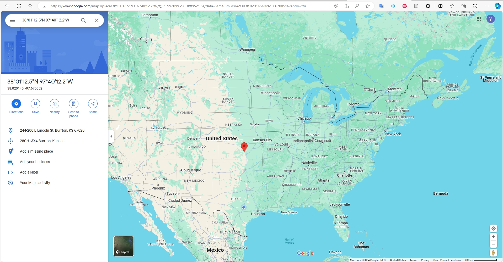

### 1. Project Description

Our project focuses on leveraging the Credit Card Fraud Prediction Dataset available on Kaggle to create a robust containerized web application. This application will utilize databases for efficient data storage and management, enabling user querying and facilitating job queues. By employing Flask, we will develop API endpoints that provide users with access to comprehensive summary statistics and plots derived from the Credit Card Fraud dataset. More importantly, considering the widespread utilization of this dataset for machine learning-based fraud detection, we aim to design our application to accept credit card input for predicting potential fraud from a pre-trained model we develop. This will allow users to submit a job, and retrieve a prediction about whether the particular credit card attributes are likely fraudulent.

### 2. Project Importance

This project is essential as it tackles the pressing issue of credit card fraud by using advanced explainable AI techniques on the Credit Card Fraud Prediction Dataset from Kaggle. It will provide a containerized web application that offers real-time fraud prediction, enhancing security measures for financial institutions and protecting consumers from fraudulent transactions.

### 3. Data

**Source: https://www.kaggle.com/datasets/kelvinkelue/credit-card-fraud-prediction**

The dataset "Credit Card Fraud Prediction" is designed to evaluate and compare various fraud detection models. It comprises 555,719 records across 22 attributes, featuring a comprehensive mix of categorical and numerical data types with no missing values. Essential components of the dataset include:

- Transaction Details: Precise timestamps, merchant information, and transaction amounts.
- Fraud Indicator: A binary attribute marking transactions as fraudulent or legitimate, serving as the primary target for predictive modeling.
- Cardholder Information: Names, addresses, job titles, and demographics, providing a deep dive into the profiles involved in transactions.
- Geographical Data: Location details for both merchants and cardholders to explore spatial patterns in fraud occurrences.

This dataset is a rich resource that fosters the development, testing, and comparison of different fraud detection techniques. It is a valuable tool for researchers and practitioners dedicated to advancing the field of fraud detection through innovative modeling and analysis.

### 4. Software Diagram

The following software diagram captures the primary components and workflow of our system...

### 5. Description of Folder Contents

- `Dockerfile`: Contains instructions for building a Docker image of our program
- `docker-compose.yaml`: YAML file used to replace running the `docker build` and `docker run` commands for deploying a container. Orchestrates 3 services together: Redis Database, Flask App, Worker.
- `src/api.py`: Main Python script that interacts with our fraud data set, hosts the Flask app that allows the user to query for information, as well as interacts with the Redis database.
  - [GET] `/transaction_data`: Returns all data from Redis
  - [POST] `/transaction_data`: Puts data into Redis
  - [DELETE] `/transaction_data`: Deletes data in Redis
  - [GET] `/transaction_data_view?limit=<int>&offset=<int>`: Returns a slice view of the data, beginning at the offset parameter (which defaults to zero) and ending at (offset + limit). limit parameter defaults to 5.
  - [GET] `/amt_analysis`: Returns statistical descriptions of the transaction amounts in the dataset.
  - [GET] `/amt_fraud_correlation`: Returns the correlation between transaction amount ('amt') and fraud status ('is_fraud')
  - [GET] `/jobs/<jobid>` : Returns all job information for a given JOB ID
  - [GET] `/jobs`: Returns all existing JOB IDs
  - [POST] `/jobs`: Creates a new job with a unique identifier (uuid)
    - The `/jobs` POST request must include a data packet in JSON format which is stored along with the job information. For our application, the client must provide the following JSON formatted data:
      '{"Year Modified Start": <start_year>, "Year Modified End": <end_year>}' -H "Content-Type: application/json"
  - [DELETE] `/jobs`: Deletes all jobs
  - [GET] `/results/<jobid>`: Return requested job result in the form of a JSON dictionary. If the job has not yet been finished, the api returns a message indicating so.
- `src/jobs.py`: Initializes databases and provides the functionality to create/submit/put jobs on the queue.
- `src/worker.py`: Pull jobs off of the queue and executes job functionality.
- `src/ML_model.py`: Implements a Random-Forest Classifier to detect fraud with a high accuracy of 99%, leveraging feature importance analysis to enhance predictive insights.
- `requirements.txt`: Text file that lists all of the Python non-standard libraries used to develop the code.
- `data/`: Local Directory for Redis container to presist data to file system across container executions.
- `test/test_api.py`: Tests functionality in `src/api.py`
- `test/test_jobs.py`: Tests functionailty in `src/jobs.py`
- `test/test_worker.py`: Tests functionailty in `src/worker.py`

Note: All throughout the code source, strategic logging is implemented to alert the developer of important events and bugs that arise. Logs are stored in `logger.log`

To view the logger for each container, execute the following: `docker exec -it <container_id> bash`. `logger.log` is found in `/app`. Logs concerning the `worker` container are found by executing the command for the `worker` container id. Get the container id by running: `docker ps -a`.

### 6. Flask Application

#### Instructions on How to Deploy Containerized Code with docker-compose

Once the code has been pulled, execute: `docker-compose up`.

This will effectively build and deploy the docker images as containers ensuring port to port mapping and proper organization and dependency between the containers. Specifically, the command builds the `worker` and `flask-app` images and pulls the `redis` stock image for use.

Execute `docker ps -a` to ensure the three containers are up and runnning. You should see the following:

```
CONTAINER ID   IMAGE                           COMMAND                  CREATED          STATUS                      PORTS                                       NAMES
0ed6746af37c   username/fraud_detect_app:1.0   "python3 api.py"         58 seconds ago   Up 57 seconds               0.0.0.0:5173->5173/tcp, :::5173->5173/tcp   guardianai_flask-api_1
e89eb33406de   username/fraud_detect_app:1.0   "python3 worker.py"      58 seconds ago   Up 57 seconds                                               guardianai_worker_1
dc51e6ac5ae9   redis:7                         "docker-entrypoint.s…"   59 seconds ago   Up 58 seconds               0.0.0.0:6379->6379/tcp, :::6379->6379/tcp   guardianai_redis-db_1
```

- Note for developers: If you make edits to any of the contaner source files (i.e, `worker.py` or `app.py`), you can redeploy the containers by simply running: `docker-compose up --build  <edited_image>` rather than executing `docker-copmpose down` followed by `docker-compose up --build -d` again.

Once you have ensured that the microservice is up and running, you can access the application via `curl` commands.

#### Instructions For Accessing Web App Routes & Route Output Descriptions

While the service is up (after executing `docker-compose up`), you may curl the following example commands to interact with the application.

**Curl Commands to Routes: `curl http://<ipaddress>:port/route`**

1. **POST Data to Redis Database Endpoint**

- **Description**: This endpoint stores the raw data into a Redis database that supports data persistence across container executions. POSTing the data takes a few minutes.

```shell
curl -X POST localhost:5173/data
```

- _expected output_

```shell
Data POSTED into Redis Database.
```

2. **GET Data from Redis Database Endpoint**

- **Description**: This endpoint retrieves all of the data stored from the Redis database as a list of dictionaries. GETting the data takes a few minutes.

```shell
curl -X GET localhost:5173/data
```

- _expected output_

```shell
{
    "Unnamed: 0": 283599,
    "amt": 55.49,
    "category": "entertainment",
    "cc_num": 4428150000000000.0,
    "city": "Colton",
    "city_pop": 761,
    "dob": "30/06/1943",
    "first": "Brittany",
    "gender": "F",
    "is_fraud": 0,
    "job": "Chief Marketing Officer",
    "last": "Guerra",
    "lat": 46.5901,
    "long": -117.1692,
    "merch_lat": 45.957848,
    "merch_long": -116.587284,
    "merchant": "fraud_Effertz, Welch and Schowalter",
    "state": "WA",
    "street": "79209 Gary Dale",
    "trans_date_trans_time": "05/10/2020 11:04",
    "trans_num": "f6ff017f02cc92423a2b88a0be0d387a",
    "unix_time": 1380971076,
    "zip": 99113
  },
  ...
  {
    "Unnamed: 0": 12259,
    "amt": 1.45,
    "category": "misc_net",
    "cc_num": 4.50254e+18,
    "city": "Ash Flat",
    "city_pop": 2856,
    "dob": "27/08/1926",
    "first": "Stephanie",
    "gender": "F",
    "is_fraud": 0,
    "job": "Hydrologist",
    "last": "Cummings",
    "lat": 36.2201,
    "long": -91.6421,
    "merch_lat": 36.198675,
    "merch_long": -90.757786,
    "merchant": "fraud_Nader-Heller",
    "state": "AR",
    "street": "1025 Robin Square",
    "trans_date_trans_time": "25/06/2020 05:50",
    "trans_num": "fad0975d67dd801858619f5009a9fb98",
    "unix_time": 1372139451,
    "zip": 72513
  }
```

3. **DELETE Data from Redis Database Endpoint**

- **Description**: This endpoint deletes all of the data stored in the Redis database. To execute other endpoints that rely on the data, `curl -X POST curl localhost:5173/data` must be re-executed.

```shell
curl -X DELETE curl localhost:5173/data
```

- _expected output_

```shell
Data DELETED from Redis Database.
```

4. **Data Example Endpoint**

- **Description**: This endpoint provides a quick look at the dataset by returning the first five entries by default. If the user wishes to see the first n records of the data set, they may specify a limit query parameter, otherwise, the first five entries are returned via: `curl -X GET localhost:5173/data_example`

```shell
curl -X GET 'localhost:5173/data_example?limit=2'
```

- _expected output_

```shell
  [
    {
      "Unnamed: 0": 0,
      "amt": 2.86,
      "category": "personal_care",
      "cc_num": 2291160000000000.0,
      "city": "Columbia",
      "city_pop": 333497,
      "dob": "19/03/1968",
      "first": "Jeff",
      "gender": "M",
      "is_fraud": 0,
      "job": "Mechanical engineer",
      "last": "Elliott",
      "lat": 33.9659,
      "long": -80.9355,
      "merch_lat": 33.986391,
      "merch_long": -81.200714,
      "merchant": "fraud_Kirlin and Sons",
      "state": "SC",
      "street": "351 Darlene Green",
      "trans_date_trans_time": "21/06/2020 12:14",
      "trans_num": "2da90c7d74bd46a0caf3777415b3ebd3",
      "unix_time": 1371816865,
      "zip": 29209
    },
    {
      "Unnamed: 0": 1,
      "amt": 29.84,
      "category": "personal_care",
      "cc_num": 3573030000000000.0,
      "city": "Altonah",
      "city_pop": 302,
      "dob": "17/01/1990",
      "first": "Joanne",
      "gender": "F",
      "is_fraud": 0,
      "job": "Sales professional, IT",
      "last": "Williams",
      "lat": 40.3207,
      "long": -110.436,
      "merch_lat": 39.450498,
      "merch_long": -109.960431,
      "merchant": "fraud_Sporer-Keebler",
      "state": "UT",
      "street": "3638 Marsh Union",
      "trans_date_trans_time": "21/06/2020 12:14",
      "trans_num": "324cc204407e99f51b0d6ca0055005e7",
      "unix_time": 1371816873,
      "zip": 84002
    }
 ]

```

5. **Amount Analysis Endpoint**

   - **Description**: This endpoint provides statistical summaries of the transaction amounts.

   ```shell
   curl localhost:5173/amt_analysis -X GET
   ```

   - _expected output_

     - **count**: Total number of transactions.
     - **mean**: Average amount of transactions.
     - **std**: Standard deviation of the transaction amounts.
     - **min**: Minimum transaction amount.
     - **25%**: 25th percentile of the transaction amounts.
     - **50%** (median): Median of the transaction amounts.
     - **75%**: 75th percentile of the transaction amounts.
     - **max**: Maximum transaction amount.

     ```shell
     {
       "25%": 9.63,
       "50%": 47.29,
       "75%": 83.01,
       "count": 555719.0,
       "max": 22768.11,
       "mean": 69.39281023322938,
       "min": 1.0,
       "std": 156.74594135531336
     }
     ```

6. **Amount-Fraud Correlation Endpoint**

   - **Description**: This endpoint calculates the correlation between transaction amounts (`amt`) and their fraud status (`is_fraud`). Correlation measures the degree to which two variables move in relation to each other. A higher positive correlation means that higher transaction amounts might be more associated with fraudulent transactions, whereas a negative correlation would indicate the opposite.

     ```shell
     curl localhost:5173/amt_fraud_correlation -X GET
     ```

   - _expected output_

     ```shell
     {
       "amt": {
         "amt": 1.0,
         "is_fraud": 0.18226707130820347
       },
       "is_fraud": {
         "amt": 0.18226707130820347,
         "is_fraud": 1.0
       }
     }
     ```

7. **Fraudulent Zipcode Information Endpoint**

   - **Description**: This endpoint calculates which zipcode has the highest number of fraudulent transactions from the dataset and retrieves geographical information for that zipcode. It serves to identify potential hotspots of fraudulent activity and provides a quick link to view the location on Google Maps.

     ```shell
     curl localhost:5173/fraudulent_zipcode_info -X GET
     ```

   - _expected output_

     - **most_fraudulent_zipcode**: The zipcode with the highest number of fraud cases.
     - **fraud_count**: The number of frauds recorded in that zipcode.
     - **latitude** and **longitude**: Geographic coordinates of the zipcode.
     - **Google Maps Link**: Direct link to view the location on Google Maps.

     ```shell
     {
       "Google Maps Link": "https://www.google.com/maps/search/?api=1&query=38.02014542,-97.67005157",
       "fraud_count": 19,
       "latitude": 38.02014542,
       "longitude": -97.67005157,
       "most_fraudulent_zipcode": "67020"
     }
     ```

   

8. **Fraud by State Endpoint**

   - **Description**: This endpoint aggregates the number of fraudulent transactions from the `fraud_test.csv` dataset by state. It provides a detailed count of fraudulent activities grouped by each state to help identify regions with higher instances of fraud.

     ```shell
     curl localhost:5173/fraud_by_state -X GET
     ```

   - _expected output_

     - Each state's abbreviation is listed along with the number of fraudulent transactions recorded in that state. This summary helps in understanding the geographic distribution of fraudulent activities.

     ```python
     {
       "fraud_counts_by_state": {
         "AK": 14,
         "AL": 63,
         "AR": 34,
         "AZ": 27,
         "CA": 76,
         ...
         "TN": 19,
         "TX": 113,
         "VA": 75,
         "WA": 30,
         "WI": 65,
         "WY": 9
       }
     }
     ```

9. **AI Analysis Endpoint**

   - **Description**: This endpoint is dedicated to analyzing and returning the importance of features from a trained machine learning model. It invokes the `train_model` function, which orchestrates the data preparation, model training, and computation of feature importances. Once the model is trained, the function assesses which features significantly impact the model's predictions and returns these feature importances in a structured JSON format. This helps in understanding the model's decision-making process and in identifying the most influential factors in the dataset.

   - **More details of our AI model:**

     - Model Description

       Our AI model employs a RandomForestClassifier to effectively detect fraudulent transactions. This model is ideal for handling complex datasets with a mixture of categorical and numerical features, making it particularly suitable for analyzing transaction data where multiple variables influence the likelihood of fraud.

     - Performance:

       On the test set, our model achieves an accuracy of 99%, highlighting its efficacy in identifying fraudulent transactions accurately.

     - Analysis Tools:

       We leverage feature importance techniques, which help in understanding the predictive power of each variable. This insight is critical for people to focus on the most impactful features.

     ```shell
     curl localhost:5173/ai_analysis -X GET
     ```

   - _expected output_

     ```shell
     {
       "feature_importances": [
         {
           "feature": "amt",
           "importance": 0.29070396208787314
         },
         {
           "feature": "time",
           "importance": 0.07287082998920907
         },
         {
           "feature": "unix_time",
           "importance": 0.05540575128302068
         },
         {
           "feature": "merch_long",
           "importance": 0.05058397954013699
         },
         ...
         {
           "feature": "year",
           "importance": 0.0
         }
       ]
     }
     ```

10. **Insert New Endpoint**

11. **Insert New Endpoint**

#### Instructions on How to Run Test Cases

Unit tests for the application are stored in the `/tests` directory and copied over to the `app` directory in the container (alongside the main scripts). To execute the test scripts, enter into the respective container interactively and execute `pytest`.

Example: Run the following commands

```shell
docker exec -it <container_id> bash
ls # Check that the test scripts are in the `/app` directory
pytest # Run pytest
```

#### Instructions to Stop Microservice

When you are ready to remove and kill the services, execute the following command: `docker-compose down`

### 7. Ethical and Professional Responsibilities

In our Credit Card Fraud Prediction project, adhering to stringent ethical and professional standards is crucial given the use of sensitive personal and transactional data. The following points outline the key ethical and professional responsibilities we uphold in the design and implementation of this project:

1. **Data Privacy and Protection**:
   - We strictly comply with data protection laws and regulations, ensuring all data collection and processing activities are lawful.
   - Implement robust encryption and security measures to protect data in storage and transit from unauthorized access or breaches.
   - Use only anonymized datasets for analysis and model training to ensure individuals cannot be identified from our system.
2. **Transparency and Explainability**:
   - Our application provides clear explanations of how it operates and makes decisions, especially regarding the machine learning models predicting whether credit card transactions are fraudulent.
   - Develop explainable AI systems that enable users to understand the reasons behind model predictions, which helps build trust in our system.
3. **Fairness and Bias Mitigation**:
   - Examine and correct potential biases in the dataset to ensure our models do not amplify these biases, which could adversely affect certain groups unfairly.
   - Regularly review the decision-making processes of our models to ensure all users benefit fairly from our services, unaffected by biases related to gender, race, age, or geographic location.
4. **Compliance and Professional Standards**:
   - Ensure all development and operational activities adhere to industry norms and professional ethical standards.
   - Conduct regular training for our team to stay updated on the latest regulations and best practices regarding data protection, client privacy, and ethical technology use.
5. **User Education and Engagement**:
   - Provide resources and support to help users understand how to safely use our platform and educate them on methods to identify and prevent credit card fraud.
   - Encourage user feedback to engage them in the continuous improvement process of our systems, ensuring our services better meet their needs.

Through these measures, we are committed to developing a technologically advanced fraud detection tool while ensuring responsible operation ethically and professionally, gaining user trust and safeguarding their rights.

### 8. Connection to Software Design Principles

Our REST API project for interacting with a Credit Card Fraud dataset connects with several core software design principles.

**Modularity:**

- Our project is structured into distinct components like the front-end REST API, back-end workers, and databases (Redis). Each component handles specific tasks: the API manages user interactions, back-end workers process jobs, and databases store data and results. This separation enhances the cohesion within each module, grouping similar functionalities and reducing complexity.

**Abstraction:**

- The project abstracts complex processes behind simpler interfaces. For example, users interact with the API through simple HTTP requests like POST, GET, and DELETE without understanding the underlying processes like job queue management or data plotting. This abstraction makes the system user-friendly and shields end users from the intricacies of the backend operations.

**Low Coupling:**

- Each component of our system is designed to operate independently as much as possible. For instance, changes in the data plotting logic in the back-end workers do not affect the front-end API’s ability to accept and manage requests. This loose coupling allows for easier maintenance and scalability of the system, as components can be updated or replaced with minimal impact on others.

**Generalization:**

- The API is designed to handle a variety of tasks related to the dataset, making it a generalized tool for data manipulation and analysis. It can be adapted or extended to other types of datasets or analytical jobs without significant changes to the core architecture, demonstrating the principle of generalization through its flexible and reusable design.

**Portability and Reproducibility:**

- By containerizing the application using Docker and deploying it on a Kubernetes cluster, our project ensures that it can be easily moved and executed in different environments, enhancing its portability. The consistent environment provided by containers also aids in achieving reproducible results, as the same configurations and dependencies are maintained across different deployments.

### 9. Reference

1. Bing Maps Locations API, https://learn.microsoft.com/en-us/bingmaps/rest-services/locations/?redirectedfrom=MSDN
2. Kaggle dataset,  https://www.kaggle.com/datasets/kelvinkelue/credit-card-fraud-prediction**

